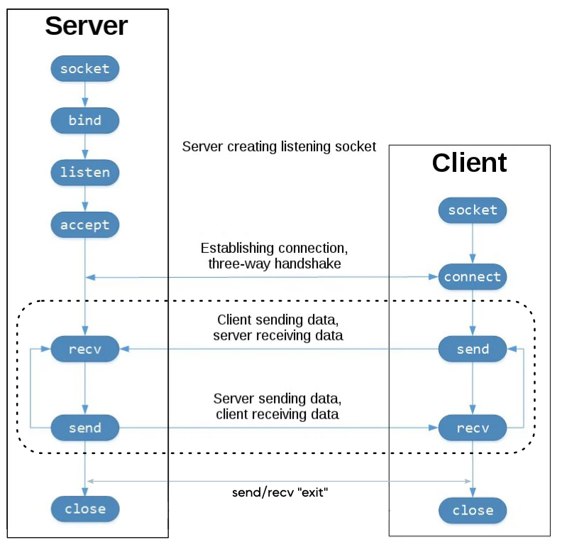

## Implementing a Chat with TCP Sockets

### ES

Implementa un único script en Python que permita a dos individuos comunicarse utilizando sockets TCP. La comunicación es bidireccional pero no simultánea, lo que significa que uno de los dos individuos debe enviar un mensaje y el otro recibirlo, y viceversa (cuando se envía un mensaje, se pasa a recibir; no se puede volver a enviar). El script debe permitir que los individuos se comuniquen indefinidamente hasta que uno de ellos decida terminar la conversación escribiendo "exit". En ese momento, la ejecución del script finaliza para ambos individuos.

### EN

Implement a single Python script that allows two individuals to communicate using TCP sockets. The communication is bidirectional but not simultaneous, meaning one of the two individuals must send a message and the other must receive it, and vice versa (when a message is sent, you switch to receiving; you cannot send again). The script should allow the individuals to communicate indefinitely until one of them decides to end the conversation by writing "exit." At this point, the script's execution ends for both individuals.

<!-- img diagram -->

