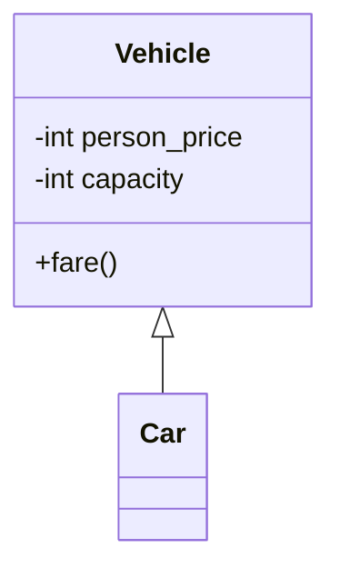

# Tema 1: Introducción a Python

> Algunos de los ejercicios realizados para la asignatura Sistemas Distribuidos 2023-24 provienen del libro de la Escuela Superior de Informática, en los capítulos 10: Python, 11: Serialización, 12: Sockets BSD y 13: Modelo Cliente-Servidor

## Python

### [Tipos de comentario](./Python/comentarios.py)

### [Tipos de dato](./Python/tipos_de_dato.py)

### [`calcular_notas`](./Python/calcular_notas.py)

Ejemplo de uso de **funciones** e **indentación estricta** en Python para, por ejemplo, calcular notas en un curso.

### Clases

Ejemplo de programación orientada a objetos con una clase [`Coche`](./Python/Clase%20Vehiculo/car.py) que extiende de [`Vehículo`](./Python/Clase%20Vehiculo/vehicle.py).

### Pruebas unitarias

Se pueden emplear clases para modelar casos de prueba, para realizar _testing_ sobre un módulo en Python. Por ejemplo, se pueden realizar casos de prueba sobre el `vehículo` y `coche` anteriores. [Aquí](./Python/Clase%20Vehiculo/unit_test.py)