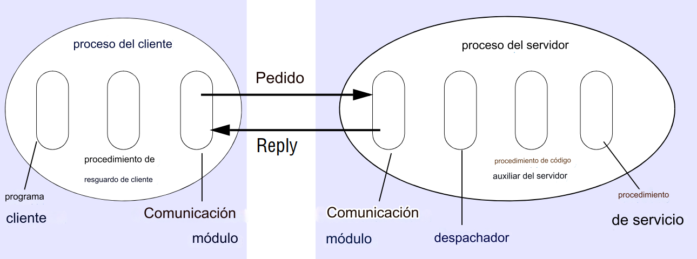
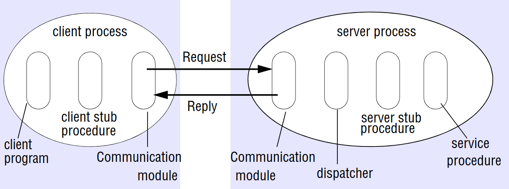

# RPC desde cero (from scratch)

## ES

Un cliente/servidor RPC mínimo desde cero con un socket TCP y serialización "estructurada".

Este ejemplo sigue los conceptos básicos de RPC según:

- Coulouris, Dollimore, Kindberg and Blair, Distributed Systems: Concepts and Design; Edición 5. Pearson Education 2012. Sección 5.3.2:

A continuación se muestran los componentes de software necesarios para implementar RPC. El cliente que accede a un servicio incluye un _procedimiento stub_ para cada procedimiento de la interfaz del servicio. El procedimiento stub se comporta como un procedimiento local para el cliente, pero en lugar de ejecutar la llamada, serializa el identificador del procedimiento y los argumentos en un mensaje de petición, que envía a través de su módulo de comunicación al servidor. Cuando llega el mensaje de respuesta, descomprime los resultados. El proceso del servidor contiene un dispatcher junto con un procedimiento stub del servidor y un procedimiento de servicio para cada procedimiento de la interfaz de servicio. El dispatcher selecciona uno de los procedimientos stub del servidor según el identificador de procedimiento del mensaje de solicitud. A continuación, el procedimiento stub de servidor deserializa los argumentos del mensaje de solicitud, llama al procedimiento de servicio correspondiente y descomprime los valores de retorno para el mensaje de respuesta. Los procedimientos de servicio implementan los procedimientos de la interfaz de servicio. Los procedimientos stub de cliente y servidor y el dispatcher pueden ser generados automáticamente por un compilador de interfaces a partir de la definición de la interfaz del servicio.

## EN

A minimal RPC client/server from scratch with a TCP socket and "struct" serialization.

This example follows RPC basics according to:

- Coulouris, Dollimore, Kindberg and Blair, Distributed Systems: Concepts and Design; Edn 5. Pearson Education 2012. Section 5.3.2:

The software components required to implement RPC are shown below. The client that accesses a service includes one _stub procedure_ for each procedure in the service interface. The stub procedure behaves like a local procedure to the client, but instead of executing the call, it marshals the procedure identifier and the arguments into a request message, which it sends via its communication module to the server. When the reply message arrives, it unmarshals the results. The server process contains a dispatcher together with one server stub procedure and one service procedure for each procedure in the service interface. The dispatcher selects one of the server stub procedures according to the procedure identifier in the request message. The server stub procedure then unmarshals the arguments in the request message, calls the corresponding service procedure and marshals the return values for the reply message. The service procedures implement the procedures in the service interface. The client and server stub procedures and the dispatcher can be generated automatically by an interface compiler from the interface definition of the service.

