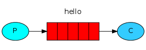
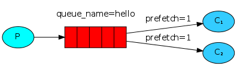
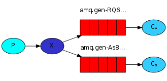
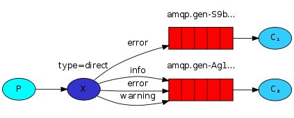
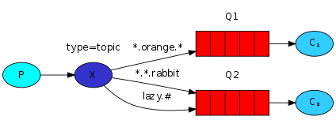
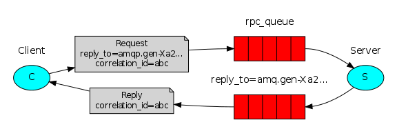

# RabbitMQ

## Instalación de librerías

```console
python -m pip install pika --upgrade
```

o más bien (Debian/Ubuntu)

```console
apt install rabbitmq-server
apt install pika
```

### Privilegios de administrador

```console
$ sudo rabbitmq-plugins enable rabbitmq_management
$ sudo service rabbitmq-server restart

$ rabbitmqadmin list queues
$ rabbitmqadmin delete queue name=<queue-name>
```

## [Hola Mundo!](./hello_v2/)



```
    (P) --> [|hello|] --> (C)

          ||||||m3|m2|m1|
```

Donde:
- `(P)` es el **productor** (programa que envía mensajes)
- `(C)` es el **consumidor** (programa que espera a que llegen mensajes)
- `[|hello|]` es la **cola de mensajes** llamada _`hello`_

```console
$ python3 consumer.py
 ---
$ python3 producer.py
```

> De este ejemplo hay dos versiones, la proporcionada por RabbitMQ está [aquí](./hello/)

## [Colas de trabajo](./work-queues/)



La idea principal detrás de las colas de trabajo (también conocidas como colas de tareas) es evitar realizar una tarea que consume muchos recursos de inmediato y tener que esperar para completarlo.

En su lugar, programamos la tarea para que se realice más tarde. Encapsulamos una tarea como un mensaje y lo enviamos a la cola. Un proceso de trabajo en ejecución en segundo plano desplegará las tareas y, finalmente, ejecutará el comando trabajo. Cuando ejecute muchos trabajadores (_workers_), las tareas se compartirán entre ellos.

### [Round-Robin](./round-robin/)

```
	P --> |||||||j3|j2|j1| 	--> W1 obtiene j1
              job           --> W2 obtiene j2
                            --> W1 obtiene j3
```

Una de las ventajas de usar una cola de tareas es la capacidad de **paralelizar el trabajo**. Si estamos acumulando un trabajo atrasado, podemos agregar más trabajadores y, de esa manera, escalar fácilmente.

Si un consumidor muere (su canal está cerrado, su conexión está cerrada o se pierde la conexión TCP) sin enviar un **acuse de recibo** (ACK), RabbitMQ comprenderá que un mensaje no se procesó completamente y lo volverá a poner en cola. Si hay otros consumidores en línea al mismo tiempo, rápidamente se lo volverá a entregar a otro consumidor. De esta manera puede estar seguro de que no se perderá ningún mensaje, incluso si los trabajadores mueren ocasionalmente.

> Para ejecutar este ejemplo es posible que se requieran 3 terminales, una para cada participante

```console
$ python3 worker.py
---
$ python3 worker.py
---
$ python3 producer.py <una_cadena_con_un_número_arbitrario_de_puntos>
```

- Nº de puntos indica el tiempo (en segundos) que requiere el trabajo para ser completado
    - Ejemplo
        ```
        python3 producer job1.... job2. job3...
            - job1 requiere 4 segundos
            - job2 requiere 1 segundos
            - job3 requiere 3 segundos
        ```

## [Publicador-Suscriptor](./publish-subscribe_v2/)



```
                        twitter1
(P) --> (X) ------>	|||||||t3|t2|t1| --> (S1) recibe t1, t2, t3...
         |
         +-------->	|||||||t3|t2|t1| --> (S2) recibe t1, t2, t3...
	                    twitter2
```

El proceso de comunicación se inicia con el productor. Este programa envía los mensajes a un intercambio (exchange) en RabbitMQ. El intercambio es responsable de recibir los mensajes y determinar a qué colas (queues) enviarlos. Cada cola está asociada con uno o más suscriptores interesados en recibir los mensajes enviados a dicha cola.

Cuando un mensaje llega al intercambio, este lo enruta a las colas correspondientes basándose en el tipo de intercambio y las reglas de enrutamiento configuradas. Los suscriptores están constantemente escuchando sus colas en busca de nuevos mensajes. Una vez que un suscriptor recibe un mensaje de la cola, puede procesarlo o realizar cualquier acción requerida.

**En el ejemplo de la versión 2 un publicador envía un _tweet_ y $n$ suscriptores recibe ese mismo _tweet_**

> Puede ser útil tener 3 consolas, una para cada participante:

```console
$ python3 subscriber.py
---
$ python3 subscriber.py             (<- otro)
---
$ python3 publisher.py <my_tweet>
```

## [Routing](./routing/)



### Bindings 

Un enlace (_binding_) es una relación entre un intercambio (_exchange_) y una cola. Esto puede leerse simplemente como:
> _la **cola** está interesada en los mensajes de "este" **intercambio**_

Los enlaces pueden tomar un parámetro `route_key` adicional. Para evitar la confusión con un parámetro `basic_publish`, lo llamaremos clave vinculante. El significado del enlace depende del tipo de intercambio
- Para los tipo `fanout` se ignora su valor
- **Direct exchange**. Un mensaje va a las colas cuya `binding key` coincide exactamente con la `routing key` del mensaje

> Es perfectamente legal vincular varias colas con la misma clave de vinculación. En ese caso, el intercambio directo se comportará como un _fanout_ y transmitirá el mensaje a todas las colas coincidentes (_broadcast_).

## Patrón



```
	   binding_key     twitter1
(P) --> (E) ------>	|||||||t3|t2|t1|  --> S1 recibe t1, t2
         |
         |----->	|||||||t3|t2|t1|  --> S2 recibe t1, t3
	   binding_key     twitter2
```

Los mensajes enviados a un intercambio de `topics` no pueden tener una clave de enrutamiento arbitraria; debe ser una lista de palabras, **delimitadas por puntos**.

La lógica detrás del intercambio de `topics` es similar a la directa: un mensaje enviado con una `routing key` particular se entregará a todas las colas que estén vinculadas con una `binding key` coincidente. Sin embargo, existen dos casos especiales importantes para la vinculación de claves:

- `*` Sustituye **una palabra**
- `#` Sustituye **cero a muchas palabras**

### [Topic exchange](./topics/)

El intercambio de temas es poderoso y puede comportarse como otros intercambios:

- Cuando una cola está vinculada con la clave de vinculación `"#"` (hash), recibirá **todos** los mensajes, independientemente de la `routing key`, como en el intercambio `fanout`.
- Cuando los caracteres especiales `"*"` (estrella) y `"#"` (almohadilla) _no se utilizan en los enlaces_, el **intercambio** de temas se comportará como uno **directo**.

> Es posible que se requieran 3 consolas, una para cada participante

```console
$ python3 subscriber.py <binding_key>
---
$ python3 subscriber.py <binding_key>
---
$ python3 publisher.py <routing_key> <my_tweet>
```

- `binding_key`: Patrón con formato "$\text{palabra}_1.\text{palabra}_2.\ \dots \ .\text{palabra}_n$"
- $\text{palabra}_1.\text{palabra}_2.\ \dots \ .\text{palabra}_n$ pueden usar _wildcards_
    - Ejemplo:
    ```console
    python3 subscriber.py tweets.*johndoe.*
    ```
- `routing_key` lista de palabras delimitada por puntos con formato "$\text{palabra}_1.\text{palabra}_2.\ \dots \ .\text{palabra}_n$"
    - Ejemplo:
    ```console
    python3 publisher.py "tweets.johndoe.multimedia" "Hello world ..."
    ```

**Ejemplo completo:**

```console
python3 publisher.py "hoy.cr" "Ven gratis al cine"
python3 publisher.py "mañana.madrid" "Ven al teatro por 10 euros"
python3 subscriber.py "*.madrid"
python3 subscriber.py "hoy.*"
```

## [RPC](./factorial-rpc/)



En general, hacer RPC sobre RabbitMQ es fácil. Un cliente envía un mensaje de solicitud y un servidor responde con un mensaje de respuesta. Para recibir una respuesta, el cliente debe enviar una dirección de cola de 'devolución de llamada' con la solicitud.

### Propiedades de los mensajes

- `delivery_mode`: marca un mensaje como persistente (con un valor de 2) o transitorio (cualquier otro valor). [Quizás recuerdes esta propiedad del segundo tutorial](#colas-de-trabajo)
- `content_type`: se utiliza para describir el tipo _mime_ de la codificación. Por ejemplo, para la codificación _JSON_ de uso frecuente, es una buena práctica establecer esta propiedad en: _`application/json`_
- `reply_to`: se usa comúnmente para nombrar una cola de devolución de llamada (_`callback` queue_).
- `correlation_id`: útil para correlacionar respuestas RPC con solicitudes.
    - Para mayor eficiencia, se usará una única _`callback` queue_ por cliente, usando esta propiedad como identificador único de petición, y valores extraños permitirán descartar con seguridad el mensaje: no pertenecen a nuestras peticiones.
    - El cliente deberá procesar duplicados de forma elegante, en caso de reinicios del servidor RPC (condiciones de carrera?)
    - Servidor RPC idempotente

---

Se propone como ejercicio simular RPC (llamada a procedimiento remoto) con RabbitMQ. Para ello es necesario crear dos programas, uno que actúe como cliente y otro como servidor. El servidor sólo realiza una tarea que es calcular el factorial de un número. El cliente, por su parte, envía un número al servidor y espera a que devuelva el resultado del cálculo factorial.

Para implementar esta aplicación, deberá crear dos colas de mensajes, una para manejar solicitudes y otra para manejar respuestas. El cliente enviará un mensaje a la cola de solicitudes y esperará a que el servidor envíe un mensaje a la cola de respuestas. El servidor, a su vez, escuchará la cola de solicitudes y enviará el resultado a la cola de respuestas.

Tenga en cuenta que el cliente puede especificar, al publicar un mensaje, cuál es la cola de mensajes de respuesta a la que el servidor debe enviar el resultado. Además, será necesario vincular cada solicitud con su correspondiente respuesta. Para hacer esto, puede utilizar el identificador de correlación de mensajes proporcionado por RabbitMQ:

```python
properties = pika.BasicProperties(
    reply_to = results_queue,
    correlation_id = correlation_id
)
```