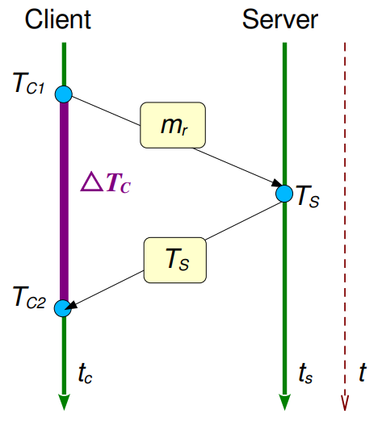

# Tema 5: Tiempo y Estados

El tiempo es una cantidad que a menudo queremos medir con precisión. Para saber a qué hora del día ocurrió un evento particular en una computadora en particular, es necesario sincronizar su reloj con una fuente de tiempo externa autorizada.

Un método de sincronización externa para los relojes de procesos $C_i$ (empleando una fuente de tiempo fiable: UTC) es el **Algortimo de Cristian**:

<div align="center">



</div>

$$
    T = T_S+\dfrac{\Delta T_c}{2} = T_S+\dfrac{T_{C2}-T_{C1}}{2};\ \ 
    \varepsilon=\pm\dfrac{\Delta T_c}{2}
$$

Se proponen dos implementaciones en ZeroC Ice, **una de ellas corresponde al ejercicio evaluable: la versión 2**:
> La versión 1 es una modificación del ejemplo básico de ZeroC Ice

Dado [`cristian.ice`](./Ejercicio%20Entregable/cristian.ice):
```
module ssdd {
  interface Cristian {
    double getServerTime(string dni, double tc1);
  };

  interface SyncReport {
    void notifyTime(string dni, string fullname, double tc2, double newTime, double error);
  };
};
```

```python
#!/usr/bin/python3
# Alg. de Cristian con ZeroC Ice (ver. 2)
import time
import ssdd
import Ice
import sys
Ice.loadSlice('cristian.ice')

# Cristian -t -e 1.1:tcp -h 192.168.8.224 -p 4080 -t 60000
# SyncReport -t -e 1.1:tcp -h 192.168.8.224 -p 4080 -t 60000


class Client(Ice.Application):
    def run(self, argv):
        proxy = self.communicator().stringToProxy(argv[1])
        # proxy = self.communicator().stringToProxy('Cristian -t -e 1.1:tcp -h 192.168.8.224 -p 4080 -t 60000')
        _cristian = ssdd.CristianPrx.checkedCast(proxy)

        if not _cristian:
            raise RuntimeError('Invalid proxy')

        # print(_cristian)
        tc1 = time.time()
        print(tc1)
        server_time = _cristian.getServerTime('02319161W', tc1)
        tc2 = time.time()
        print(tc2)
        delta = tc2-tc1
        half_delta = delta/2
        print(delta, half_delta)
        print(server_time)

        new_time = server_time + half_delta

        proxy_2 = self.communicator().stringToProxy(
            'SyncReport -t -e 1.1:tcp -h 192.168.8.224 -p 4080 -t 60000')
        _notify = ssdd.SyncReportPrx.checkedCast(proxy_2)

        if not _notify:
            raise RuntimeError('Invalid proxy 2')

        print(new_time)

        _notify.notifyTime(
            '01234567X', 'Raúl Jiménez de la Cruz', tc2, new_time, half_delta)

        return 0


sys.exit(Client().main(sys.argv))
```
